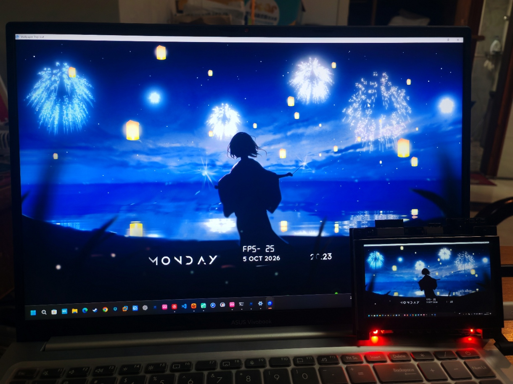
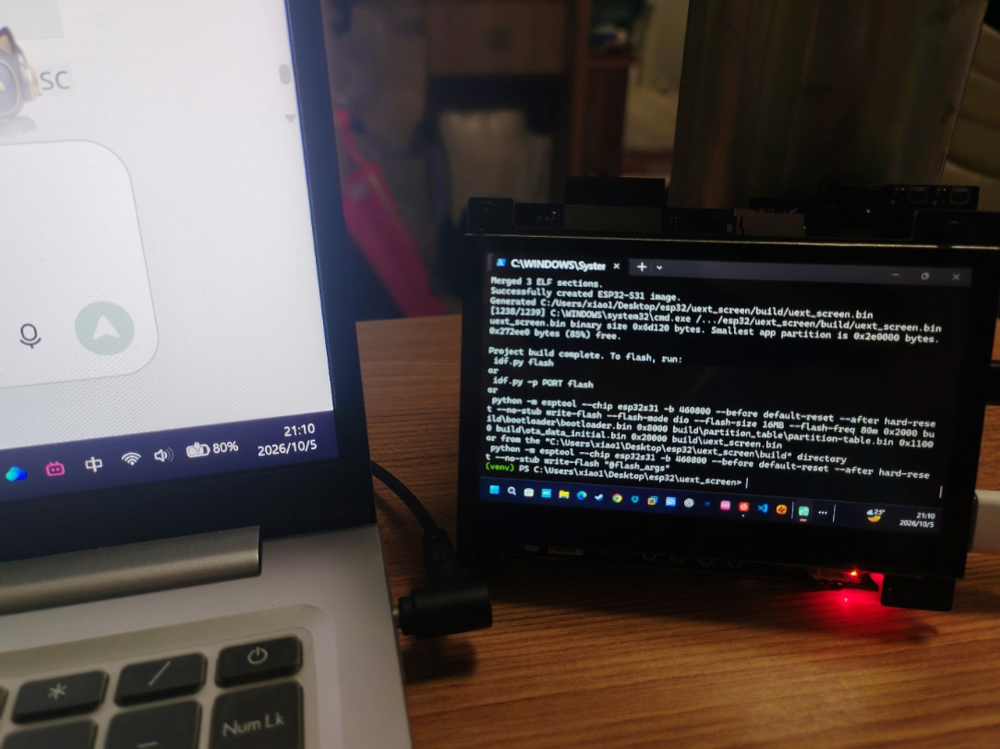
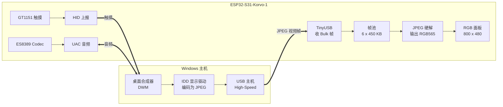

<div align="center">

# uext_screen

**把 ESP32-S31-Korvo-1 开发板变成一块 USB 扩展屏**

一根 USB 线插到电脑上，Windows 就多出一块 **800 × 480 @ 60 FPS** 的显示器，
并且同时自带**五点触摸屏**和 **48 kHz 声卡**。不需要 HDMI 采集卡，不需要额外供电。





*左：笔记本与板子作为扩展屏显示同一桌面 · 右：编译烧录成功、实机点亮*

</div>

---

## 特性

| | |
| --- | --- |
| **显示** | 800 × 480 RGB565 面板，最高 60 FPS |
| **触摸** | GT1151 五点电容触摸，以 HID 多点触摸设备回报给主机，可直接操作电脑 |
| **音频** | UAC 声卡：扬声器 + 麦克风，48 kHz / 16 bit / 立体声 |
| **连接** | 单根 USB 线（板载 OTG **High-Speed** PHY，480 Mbps） |
| **依赖** | 全部组件已离线 vendored，**编译不需要联网** |
| **主机端** | Windows 10 / 11，驱动已签名，**无需测试模式** |

---

## 工作原理

板子被伪装成一台 USB 显示器。主机（Windows 的 IDD 间接显示驱动）把桌面画面
编码成 JPEG 通过 Bulk 端点推给板子；板子用**硬件 JPEG 解码器**解成 RGB565，
**直接写进面板帧缓冲**。全程不经过 LVGL、不经过网络栈，只有"收包 → 解码 → 刷屏"一条流水线。



三条通路共用一根 USB 线，设备端只接受一种帧格式（JPEG），并对每帧做尺寸与长度校验，
异常帧只丢弃、不崩溃。

**为什么能跑到 60 FPS**：JPEG 每帧典型 50~150 KB，而非 RAW 的 750 KB，带宽压力骤降；
解码走硬件、输出直落面板帧缓冲；帧池与面板缓冲全部放在 PSRAM，不占内部 RAM。

**资源占用**

| 资源 | 占用 |
| --- | --- |
| JPEG 帧池 | 6 × 450 KB ≈ 2.7 MB（PSRAM） |
| 面板帧缓冲 | 2 × 800 × 480 × 2 B ≈ 1.5 MB（PSRAM） |
| 固件镜像 | ≈ 450 KB（`factory` 分区 4 MB） |

**源码地图**

| 文件 | 职责 |
| --- | --- |
| `main/usb_extend_screen.c` | `app_main()`：USB → LCD → 触摸 |
| `main/app_usb.c` | USB PHY（UTMI/HS）与 TinyUSB 初始化 |
| `main/app_vendor.c` | 收帧主逻辑：帧头解析、帧池流转、`transfer_task` |
| `main/usb_frame.c` | 帧池与"空帧 / 满帧"双队列 |
| `main/app_lcd_s31.c` | JPEG 硬解 + RGB 面板直写 |
| `main/app_touch.c` / `app_hid.c` | GT1151 读取与 HID 上报 |
| `main/app_uac.c` | UAC 声卡双向音频 |
| `main/tusb/` | USB 描述符（VID `0x303A` / PID `0x2986`）与 TinyUSB 配置 |
| `components/esp32_s31_korvo_1/` | 板级支持包（面板 / 触摸 / codec） |

---

## 上手教程

### 硬件准备

- **ESP32-S31-Korvo-1** 开发板（板载 800×480 RGB 屏 + GT1151 触摸 + ES8389 codec）；
- 一根**数据线**（不是纯充电线），插在板子的**高速 USB / OTG 口**上，**不是** UART 调试口；
- Windows 10 / 11 x64 主机。

> 本固件日志走 UART0（115200）+ USB-Serial-JTAG 次级控制台，与副屏占用的 OTG 控制器是
> **不同外设**，因此"插着副屏线"时依然能看串口日志。

### 1. 安装 ESP-IDF（EIM）

乐鑫自 ESP-IDF v6.0 起推荐用 **EIM（ESP-IDF Installation Manager）** 管理环境。
本项目在 **v6.1** 上验证通过。

```powershell
# 用 WinGet 安装 EIM（推荐）
winget install Espressif.EIM

# 或从官网下载 .exe 安装包后双击运行
# https://dl.espressif.com/dl/eim/
```

然后安装 ESP-IDF 本体：

- **图形界面**：启动 `eim` → **New Installation** → **Start Installation**
  （要固定版本选 **Custom Installation** 并指定 **v6.1**；国内网络慢可在 EIM 里切换镜像源）；
- **命令行**：`eim wizard`（交互式）或 `eim install -i v6.1`。

**装完后必须先激活环境**，三种方式任选：

| 方式 | 操作 |
| --- | --- |
| 桌面快捷方式 | 双击 EIM 创建的 `IDF_v6.1_Powershell`，直接得到已激活的终端 |
| EIM 图形界面 | `Manage Installations` → `Open Dashboard` → 选版本 → `Open IDF Terminal` |
| 命令行 | `eim run "idf.py build"`，无需手动激活（EIM 0.8.1+） |

### 2. 获取源码

```bash
git clone git@github.com:xkk6663/uext_screen.git
cd uext_screen
```

### 3. 编译与烧录

在**已激活的** ESP-IDF 终端中：

```bash
idf.py build                    # 首次约 2~5 分钟
idf.py -p COM5 flash monitor    # 烧录并打开串口（Ctrl+] 退出）
```

目标芯片、flash 大小、分区表、PSRAM 速率都已固化在 `sdkconfig` 里，**无需 `set-target` 或 `menuconfig`**。
若 `build/` 是陈旧产物，先 `idf.py fullclean`。

本工程使用**独立分区表**（只有 `factory` 一个应用分区），因此 `idf.py flash` 是安全且推荐的做法。

烧录成功、重新上电后串口应出现：

```
I (xxx) app_usb: USB Mount
I (xxx) app_lcd: fps: 59.8xxxxx
```

### 4. 在 Windows 上注册显示驱动

Windows 通过 **IDD（Indirect Display Driver）** 模型支持这类"虚拟显示器"：
驱动向系统注册一个显示适配器，桌面合成器把画面渲染给它，由驱动送往物理设备。

仓库 `windows_driver/` 下已附带**已签名**的安装包，因此**不需要测试模式**：

1. 先插上板子（高速 USB 口），确认固件已烧录运行；
2. 双击 `windows_driver/xfz1986_usb_graphic_250224_rc_sign.exe`，按提示安装；
3. 打开**设备管理器** → **显示适配器**下应出现新设备；
4. 打开**设置 → 系统 → 显示** → 应能看到一块 800×480 的新显示器。

**若没自动装上**：用 7-Zip 解压该 exe，取出 `xfz1986_usb_graphic.inf` / `.dll` / `.cat`
放到无中文无空格的路径（如 `C:\uext_driver\`）；设备管理器里找到带黄色感叹号的
`USB\VID_303A&PID_2986`，右键 → 更新驱动程序 → 浏览到该目录 → 选择"始终安装"。

> 仅当签名验证失败（例如自行重编驱动）时才需要临时**禁用驱动程序强制签名**。
> 仓库附带的是已签名版本，正常用不到。

### 5. 配置扩展屏

**设置 → 系统 → 显示** → 选中那块 800×480 的显示器 → **多显示器**选 **扩展这些显示器**
→ 拖动显示器图标调整相对位置 → 把该屏**缩放设为 100%**。

**验收**：串口出现 `USB Mount` 与周期 `fps:`；副屏出现桌面；帧率稳定 55 以上
（静态画面略低属正常）；副屏上拖动手指，主屏鼠标同步移动。

---

## 日常使用与调参

**触摸**：Windows 会将其识别为触摸设备，可在 `设置 → 蓝牙和其他设备 → 触摸` 里校准。
单指点击 = 左键，拖动 = 拖拽，最多 5 点。

**音频**：在 `设置 → 系统 → 声音` 里把输出 / 输入设备选成对应的扬声器 / 麦克风即可。

**可调参数**（`idf.py menuconfig` → *Example Configuration*）：

| 配置项 | 默认 | 说明 |
| --- | --- | --- |
| `USB_EXTEND_SCREEN_MAX_FPS` | 60 | 帧率上限 |
| `USB_EXTEND_SCREEN_JPEG_QUALITY` | 9 | 画质（1~10，越大越清晰、带宽越高） |
| `USB_EXTEND_SCREEN_FRAME_LIMIT_B` | 450000 | 单帧最大字节数 |
| `EXAMPLE_LCD_BUF_COUNT` | 2 | 面板帧缓冲数（双缓冲防撕裂） |
| `HID_TOUCH_ENABLE` / `UAC_AUDIO_ENABLE` | y | 关闭可减小体积，但**须同步把 PID 改成 0x2987 并更新驱动 INF** |

> 面板总线是 16-bit RGB565，没有 RGB888 通路，所以画质的真正旋钮是 **JPEG 质量**与**单帧上限**：
> 质量调到 10 更锐利但单帧可能翻倍，超过上限会丢帧；调低则换更稳的帧率。

---

## 目录结构

```
uext_screen/
├── CMakeLists.txt / partitions.csv / sdkconfig(.defaults)
├── README.md / LICENSE / .gitignore / .gitattributes
├── docs/images/                # 展示照片
├── windows_driver/             # 已签名的 Windows IDD 显示驱动安装包
├── main/                       # 应用源码（app_usb / app_vendor / app_lcd_s31 / ...）
└── components/                 # 全部依赖组件（离线 vendored）
    ├── esp32_s31_korvo_1/      # 板级支持包
    ├── tinyusb/ usb_device_uac/
    ├── esp_codec_dev/
    └── esp_lcd_touch/ esp_lcd_touch_gt1151/
```

---

## FAQ

**看不到新显示器？** 依次确认：① 是否插在**高速 USB 口**（不是调试串口）；② 串口是否有
`USB Mount`（没有 → 口不对或线是纯充电线）；③ 设备管理器有无黄色感叹号（有 → 按第 4 步手动装驱动）。

**帧率很低？** 检查是否插在 USB 2.0 口；检查 JPEG 质量是否调得过高导致单帧超限被丢；
静态画面下 `fps:` 本身偏低（无变化帧不重传），拖个窗口再观察。

**触摸位置对不上？** 在 `设置 → 蓝牙和其他设备 → 触摸` 里重新校准。

**编译报错？** 确认 ESP-IDF 版本为 **v6.1**（`idf.py --version`），并先 `idf.py fullclean`。

**能免驱动吗？** 不能。设备遵循自定义 Vendor 协议，Windows 没有内置驱动能理解它。

**会覆盖板子上的其它固件吗？** 本工程自带独立分区表，`factory` 从 `0x10000` 开始。
若同板还跑着其它占用该区域的固件，请自行确认分区不冲突。

---

## 许可与致谢

本项目基于 **Apache License 2.0** 发布，详见 [LICENSE](LICENSE)。

- 设备端源自乐鑫官方示例
  [`esp-iot-solution / examples / usb / device / usb_extend_screen`](https://github.com/espressif/esp-iot-solution)，
  本仓库在此基础上解耦为独立工程、离线 vendoring 全部组件、固化分区表与画质参数。
- Windows IDD 驱动源自
  [`chuanjinpang/win10_idd_xfz1986_usb_graphic_driver_display`](https://github.com/chuanjinpang/win10_idd_xfz1986_usb_graphic_driver_display)，
  仓库内附带的是乐鑫分发的已签名编译产物。
- 硬件平台：[ESP32-S31-Korvo-1](https://docs.espressif.com/projects/esp-dev-kits/en/latest/esp32s31/esp32-s31-korvo-1/index.html)。
