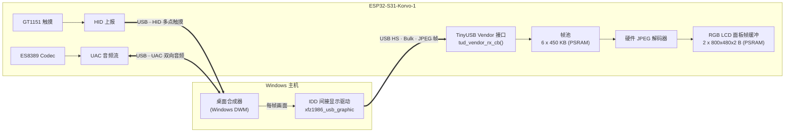

# uext_screen —— ESP32-S31-Korvo-1 USB 扩展屏固件

把一块 **ESP32-S31-Korvo-1 开发板**变成一台 **USB 副屏**：一根 USB 线插到电脑上，
Windows 就多出一块 **800 × 480 @ 60 FPS** 的显示器，并且**同时自带五点触摸屏和 48 kHz 声卡**。

不需要 HDMI 采集卡，不需要额外供电，不需要专用显卡。

| 能力 | 规格 |
| --- | --- |
| 显示 | 800 × 480，RGB565 面板，最高 **60 FPS** |
| 触摸 | GT1151 五点电容触摸，以 HID 多点触摸设备形式回报给主机 |
| 音频 | UAC 声卡：扬声器输出 + 麦克风输入，48 kHz / 16 bit / 立体声 |
| 连接 | 单根 USB 线（板载 OTG **High-Speed** PHY，480 Mbps） |
| 主机端 | Windows 10 / 11，驱动已签名，**无需测试模式** |
| 编译环境 | ESP-IDF **v6.1**（RISC-V 工具链，目标 `esp32s31`） |

---

## 目录

- [一、它是什么](#一它是什么)
- [二、工作原理](#二工作原理)
- [三、硬件要求](#三硬件要求)
- [四、上手教程](#四上手教程)
  - [4.1 安装 ESP-IDF（EIM）](#41-安装-esp-idfeim)
  - [4.2 获取源码](#42-获取源码)
  - [4.3 编译](#43-编译)
  - [4.4 烧录](#44-烧录)
  - [4.5 在 Windows 上注册显示驱动](#45-在-windows-上注册显示驱动)
  - [4.6 配置扩展屏](#46-配置扩展屏)
  - [4.7 验收](#47-验收)
- [五、日常使用](#五日常使用)
- [六、可调参数](#六可调参数)
- [七、目录结构](#七目录结构)
- [八、常见问题 FAQ](#八常见问题-faq)
- [九、帧协议补充](#九帧协议补充)
- [十、许可与致谢](#十许可与致谢)

---

## 一、它是什么

`uext_screen` 是一个**自包含的、独立的 ESP-IDF 工程**。它的全部职责只有一件事：
把开发板伪装成一台 USB 显示器，接收主机推来的画面并显示出来。

和常见的"副屏方案"相比，它的特点在于：

- **主机→设备是单向视频流**：主机（Windows 的间接显示驱动 IDD）把桌面画面编码成
  JPEG，通过 USB Bulk 端点推给板子；板子用**硬件 JPEG 解码器**解成 RGB565，
  **直接写进 RGB 面板的帧缓冲**。
- **设备→主机是触摸与音频**：板子的电容触摸屏坐标以 **HID 多点触摸**形式回报，
  所以你可以**用手指直接操作主机上的窗口**；同时板子上的喇叭/麦克风以 **UAC 声卡**
  形式出现在 Windows 的声音设备列表里。
- **固件里完全没有 UI 框架**：没有 LVGL、没有图形界面、没有文件系统。设备端只有
  "收包 → 解 JPEG → 刷屏"这一条流水线，因此代码极短、内存占用固定、行为确定。

换句话说：**它不是"跑一个应用的电脑"，而是一块"带触摸和声卡的 USB 显示器"。**

---

## 二、工作原理

### 2.1 全局架构



三条独立的数据通路共用一根 USB 线：

| 通路 | 方向 | USB 接口 | 说明 |
| --- | --- | --- | --- |
| 视频 | 主机 → 设备 | Vendor Class（Bulk OUT） | 每帧一个 JPEG，帧率上限 60 |
| 触摸 | 设备 → 主机 | HID（Interrupt IN） | 五点坐标 + 压力值 |
| 音频 | 双向 | UAC（Isochronous） | 扬声器 + 麦克风，48 kHz |

### 2.2 设备端数据通路（对应源码）

```
[USB ISR 上下文]
  tud_vendor_rx_cb()                        main/app_vendor.c:89
    │  每次收到一段 Bulk 数据
    ├─ 若还没有正在组装的帧 → 把开头当作 udisp_frame_header_t 解析
    │     type=JPG / x,y / width,height / payload_total
    │     尺寸不符或超过上限 → 进入 skip 模式丢帧（不阻塞后续帧）
    └─ buffer_fill() 把 payload 追加进当前帧
          收满 payload_total → frame_send_filled() 投进"满帧队列"

[transfer_task，固定跑在 core 1]           main/app_vendor.c:41
  frame_get_filled()   ← 阻塞等待满帧
    │
    ├─ app_lcd_draw()                       main/app_lcd_s31.c:35
    │    jpeg_decoder_process()             硬件 JPEG 解码 → RGB565
    │    esp_lcd_panel_draw_bitmap()        直写面板帧缓冲（双缓冲轮转）
    │
    └─ frame_return_empty()  归还空帧
```

几个关键设计点：

1. **帧池固定为 6 块**（`frame_allocate(6, 450 KB)`，`main/app_vendor.c:43`）。
   每块用 `jpeg_alloc_decoder_mem()` 从 PSRAM 申请，**开机一次、永不释放**，
   靠"空帧队列 / 满帧队列"在接收侧和解码侧之间流转。这样既没有运行时
   `malloc`，也不会产生内存碎片。
2. **背压策略是"丢帧"而不是"阻塞"**：如果解码跟不上（空帧队列空了），
   接收回调会进入 skip 模式，把这一帧剩余的数据全部丢弃，直到下一个帧头。
   对副屏场景来说，**丢一帧远好于卡住 USB 回调**。
3. **JPEG 解码走硬件**：`esp_driver_jpeg` 的 `jpeg_decoder_process()` 直接把
   JPEG 解成 `RGB565`，`rgb_order` 设为 `BGR` 以匹配面板时序。
4. **面板是双缓冲**（`CONFIG_EXAMPLE_LCD_BUF_COUNT=2`），解码写入 buffer A 的同时
   面板正在扫描 buffer B，写完后交换，避免撕裂。

### 2.3 USB 复合设备

设备在枚举时把自己声明为**复合设备**（Composite Device），用一个 VID/PID 承载三个接口：

| 项 | 值 | 备注 |
| --- | --- | --- |
| VID | `0x303A` | Espressif |
| PID | `0x2986` | **复合设备**：显示 + 触摸 + 音频 |
| 产品名 | `udisp` | Windows 里显示的名字 |
| 接口 0 | Vendor Class | 视频帧接收（Bulk OUT） |
| 接口 1 | HID | 五点触摸上报 |
| 接口 2 | UAC | 扬声器 + 麦克风 |

> **PID 是硬约定**：Windows 驱动的 INF 文件按 `USB\VID_303A&PID_2986` 匹配设备，
> 改动 `CONFIG_TUSB_VID` / `CONFIG_TUSB_PID` 会导致驱动**装不上**。
> 若关闭触摸或音频，可以改用纯显示 PID `0x2987`（需同步改驱动 INF）。

### 2.4 为什么能跑到 60 FPS

- **硬件 JPEG 解码**：`SOC_JPEG_DECODE_SUPPORTED=y`，解码不走 CPU 软解。
  JPEG 是"帧上限"而不是 RAW RGB 传输，一帧典型 50~150 KB，而不是 800×480×2 = 750 KB，
  大幅降低了 USB 带宽压力（60 fps × 100 KB ≈ 48 Mbps，HS 的 480 Mbps 绰绰有余）。
- **零拷贝路径**：解码输出直接落在面板帧缓冲，不经过 LVGL、不经过额外 memcpy。
- **PSRAM 支撑**：帧池（6 × 450 KB ≈ 2.7 MB）+ 面板帧缓冲（1.5 MB）全部放在
  **PSRAM**，不占用宝贵的内部 RAM。
- **网络栈完全不参与**：本固件没有 WiFi、没有蓝牙，全部算力与带宽都给显示通路。

### 2.5 资源占用

| 资源 | 占用 | 位置 |
| --- | --- | --- |
| JPEG 帧池 | 6 × 450 KB ≈ **2.7 MB** | PSRAM |
| LCD 面板帧缓冲 | 2 × 800 × 480 × 2 B ≈ **1.5 MB** | PSRAM |
| Vendor RX 缓冲 | 512 B × 10 ≈ 5 KB | 内部 RAM |
| `tusb_device_task` | 4 KB 栈 | 内部 RAM |
| `transfer_task` | 4 KB 栈 | 内部 RAM，固定在 core 1 |
| `app_touch_task` | 4 KB 栈 | 内部 RAM |
| 固件镜像 | ≈ **450 KB** | Flash（`factory` 分区 4 MB，余量充足） |

### 2.6 源码地图

| 文件 | 职责 |
| --- | --- |
| `main/usb_extend_screen.c` | `app_main()`：按序初始化 USB → LCD → 触摸 |
| `main/app_usb.c` | USB PHY（UTMI/HS）与 TinyUSB 设备栈初始化，`tud_*` 回调 |
| `main/tusb/usb_descriptors.c` | 复合设备的描述符（VID/PID/接口/端点） |
| `main/tusb/tusb_config.h` | 接口/端点/缓冲尺寸配置 |
| `main/app_vendor.c` | **视频收帧主逻辑**：帧头解析、帧池流转、`transfer_task` |
| `main/usb_frame.c` | 帧池与双队列（空帧/满帧）实现 |
| `main/app_lcd_s31.c` | JPEG 硬件解码 + RGB 面板直写 |
| `main/app_touch.c` | 读 GT1151 并投递给 HID |
| `main/app_hid.c` | HID 报告队列与发送（带"发送完成"通知） |
| `main/app_uac.c` | UAC 声卡：把主机音频写到 codec，把 mic 数据回传 |
| `components/esp32_s31_korvo_1/` | 板级支持包（BSP），提供面板/触摸/codec 初始化 |
| `components/tinyusb/` | USB 协议栈（vendored，免联网） |
| `components/usb_device_uac/` | UAC 音频类实现 |
| `components/esp_codec_dev/` 等 | 编解码器与触摸驱动 |

---

## 三、硬件要求

| 项 | 要求 |
| --- | --- |
| 开发板 | **ESP32-S31-Korvo-1**（16 MB flash，板载 800×480 RGB 屏 + GT1151 触摸 + ES8389 codec） |
| USB 线 | 一根**数据线**（非纯充电线） |
| USB 口 | 必须插在板子的**高速 USB / OTG 口**上，**不是** UART 调试口 |
| 主机 | Windows 10 / 11 x64（驱动已签名，无需测试模式） |
| 扬声器 | 可选，用来验证 UAC 音频输出 |

> **关于"高速 USB 口"**：ESP32-S31-Korvo-1 上通常有多个 USB 接口，其中一个是
> USB-Serial-JTAG（用于看串口日志），另一个是 **OTG 高速口**（用于副屏）。
> 插错口的话 Windows 只会看到一个串口设备，看不到显示器。
> 本固件的日志走 UART0（115200）+ USB-Serial-JTAG 次级控制台，
> 与副屏占用的 OTG 控制器是**不同的外设**，因此"插着副屏线"时依然能看日志。

---

## 四、上手教程

### 4.0 总览

```
安装 ESP-IDF (EIM)
      │
      ▼
克隆本仓库 ──► idf.py build ──► idf.py flash ──► 板子插到 PC 高速 USB 口
                                                        │
                                                        ▼
                          PC 安装 IDD 显示驱动 ──► Windows 多出一块显示器
                                                        │
                                                        ▼
                                          显示设置里选「扩展」即可使用
```

### 4.1 安装 ESP-IDF（EIM）

乐鑫从 ESP-IDF v6.0 起，官方推荐用 **EIM（ESP-IDF Installation Manager）** 来安装
并管理 ESP-IDF 环境，替代了过去手工下载 install.bat 的方式。本项目在
**ESP-IDF v6.1** 上验证通过，建议安装同一版本。

#### 方式 A：WinGet 安装（推荐）

以普通用户身份打开 **PowerShell**，执行：

```powershell
# 图形界面版（推荐多数用户）
winget install Espressif.EIM

# 或仅命令行版
winget install Espressif.EIM-CLI
```

日后升级 EIM：

```powershell
winget upgrade Espressif.EIM
```

#### 方式 B：直接下载安装包

不想用 WinGet 的话，可以从以下任一处下载 `.exe` 安装包，双击运行：

- Espressif 官方下载页：<https://dl.espressif.com/dl/eim/>
- EIM 的 GitHub Releases：<https://github.com/espressif/idf-im-ui/releases>

> 提示：如果下载的是 **CLI 版**（`eim-cli-*.exe`），**必须从终端运行**，
> 双击只会闪一下就退出（它会把帮助信息打印完然后关闭），这是正常现象：
> 在 PowerShell 里 `cd` 到文件所在目录，执行 `.\eim-cli-*.exe --help`。

#### 方式 C：用 EIM 安装 ESP-IDF

EIM 装好以后，用它来安装 ESP-IDF 本体与工具链：

**图形界面（适合大多数人）**

1. 从开始菜单启动 **ESP-IDF Installation Manager**（命令 `eim`）。
2. 在 **New Installation** 下点击 **Start Installation**。
3. 若要固定版本，选 **Custom Installation** 并指定 **v6.1**；
   想省事就点 **Start Easy Installation** 装最新稳定版。
4. 点 **Start Installation**，等待进度条走完（会下载工具链，约 1~2 GB，视网络而定）。
   国内网络较慢时，可在 EIM 里切换 **镜像源（Mirror）** 加速。

**命令行**

```powershell
# 交互式向导（可选版本、路径、镜像源）
eim wizard

# 或非交互式，装最新稳定版
eim install

# 指定版本
eim install -i v6.1
```

#### 安装完成后：进入 ESP-IDF 环境

安装成功后，**必须"激活环境"**才能使用 `idf.py`。三种方式任选其一：

| 方式 | 操作 |
| --- | --- |
| **桌面快捷方式**（最省事） | EIM 会在桌面创建形如 `IDF_v6.1_Powershell` 的快捷方式，双击即打开一个**已激活 ESP-IDF 环境**的 PowerShell |
| **EIM 图形界面** | 打开 `eim` → **Manage Installations** → **Open Dashboard** → 选版本 → **Open IDF Terminal** |
| **命令行直跑** | `eim run "idf.py build"`（无需手动激活，EIM 0.8.1+ 支持） |

> 下文所有 `idf.py ...` 命令，都请在**已激活的 ESP-IDF 终端**里执行。

### 4.2 获取源码

```bash
git clone git@github.com:xkk6663/uext_screen.git
cd uext_screen
```

> 本仓库已经把所有依赖组件（TinyUSB、UAC、codec、触摸驱动等）**vendored 到
> `components/` 目录**，因此**编译过程不需要联网**，也不受组件仓库抽风影响。

### 4.3 编译

在已激活的 ESP-IDF 终端中：

```bash
idf.py build
```

首次编译约 2~5 分钟。编译完成后会在 `build/` 下产出：

```
build/bootloader/bootloader.bin
build/partition_table/partition-table.bin
build/uext_screen.bin          <-- 应用固件
```

> 目标芯片（`esp32s31`）、flash 大小（16 MB）、分区表、PSRAM 速率等
> 都已经固化在 `sdkconfig.defaults` / `sdkconfig` 里，**无需再跑 `set-target` 或 `menuconfig`**。
> 万一 `build/` 目录是从别处拷来的陈旧产物，先执行 `idf.py fullclean` 再编译。

### 4.4 烧录

把开发板接到 PC，确认串口号（Windows 下形如 `COM5`，可在设备管理器里查看），然后：

```bash
# 只烧录
idf.py -p COM5 flash

# 烧录并打开串口监视器（Ctrl+] 退出）
idf.py -p COM5 flash monitor
```

> 本工程使用**独立分区表**（只有 `factory` 一个应用分区），
> 所以 `idf.py flash` 是安全且推荐的做法——它只会把固件写到本工程自己的分区，
> 不会影响板子上任何其它固件。

烧录成功、重新上电后，串口应能看到类似日志：

```
I (xxx) app_usb: USB Mount
I (xxx) app_lcd: fps: 59.8xxxxx
```

此时板子已经在等主机推画面了——但**Windows 还认不出它是一块显示器**，
需要下一步安装驱动。

### 4.5 在 Windows 上注册显示驱动

这是让 Windows 把这块板子当作"显示器"的关键一步。

#### 原理

Windows 从 Win10 1703 起提供 **IDD（Indirect Display Driver，间接显示驱动）** 模型：
一个用户态驱动可以向系统注册一个"虚拟显示适配器"，Windows 的桌面合成器就会
把画面渲染给它，由驱动自行决定怎么把像素送到物理设备上。本项目的 Windows 端驱动
正是这样一个 IDD 驱动（基于开源实现
[`chuanjinpang/win10_idd_xfz1986_usb_graphic_driver_display`](https://github.com/chuanjinpang/win10_idd_xfz1986_usb_graphic_driver_display)），
它把画面编码成 JPEG，通过 Vendor Bulk 端点推给板子。

本仓库的 `windows_driver/` 目录下已经附带**已签名**的安装包：

```
windows_driver/xfz1986_usb_graphic_250224_rc_sign.exe
```

因为已经过代码签名，**不需要开启测试模式**，也不需要禁用驱动签名强制。

#### 步骤

1. **先把板子插上**（高速 USB 口），确认固件已经烧录并运行。

2. 双击 `windows_driver/xfz1986_usb_graphic_250224_rc_sign.exe`，按提示点击安装。

3. 安装完成后，打开**设备管理器**，在 **显示适配器** 分类下应当能看到一个新设备
   （名类似 `xfz1986 usb graphic`）。同时在 **通用串行总线设备 / 人体学输入设备**
   下应当能看到对应的 USB 复合设备。

4. 打开 **设置 → 系统 → 显示**，在"显示器"下拉里应当能看到**第二块显示器**
   （分辨率 800×480）。

> **如果第 3 步没出现新显示器**，说明驱动没有自动匹配上，走下面的手动安装。

#### 手动安装（自动安装失败时）

1. 右键 `xfz1986_usb_graphic_250224_rc_sign.exe` →
   用 7-Zip / WinRAR **解压**，取出其中的
   `xfz1986_usb_graphic.inf`、`xfz1986_usb_graphic.dll`、`xfz1986_usb_graphic.cat`，
   放到一个**没有中文和空格的路径**下（例如 `C:\uext_driver\`）。

2. 打开**设备管理器**，找到带**黄色感叹号**的未知设备
   （硬件 ID 应为 `USB\VID_303A&PID_2986`）。

3. 右键 → **更新驱动程序** → **浏览我的电脑以查找驱动程序** →
   选择 `C:\uext_driver\` → 若弹出"Windows 无法验证此驱动程序软件的发布者"，
   选择 **始终安装此驱动程序软件**。

4. 安装完成后，**显示适配器**下会出现新显示器。

> 只有在签名验证失败（例如自行重新编译了驱动）时，才需要临时
> **禁用驱动程序强制签名**：`设置 → 更新和安全 → 恢复 → 高级启动 → 立即重新启动`
> → `疑难解答 → 高级选项 → 启动设置 → 重启` → 选择 `禁用驱动程序强制签名`。
> 仓库里附带的安装包是已签名版本，正常情况下用不到这一步。

### 4.6 配置扩展屏

驱动装好后，Windows 会把这块屏当普通显示器对待：

1. **设置 → 系统 → 显示**；
2. 在顶部选中那块 800×480 的显示器；
3. **多显示器** 下拉选择：
   - **扩展这些显示器**（推荐）—— 把桌面延伸到副屏上；
   - **复制这些显示器** —— 主屏与副屏显示同样内容；
   - **仅在 X 上显示** —— 只在一处显示；
4. 拖动显示器图标可以调整副屏相对于主屏的**位置**（决定鼠标从哪个方向"滑"过去）；
5. 在 **缩放与布局** 里把该显示器的缩放设为 **100%**（800×480 分辨率很小，放大反而会挤）。

### 4.7 验收

| 项 | 判据 |
| --- | --- |
| 显示 | 串口日志出现 `USB Mount`，随后周期性打印 `fps:`；副屏出现桌面画面 |
| 帧率 | 串口 `fps:` 稳定在 **55 以上**（静态画面会略低，属正常） |
| 触摸 | 在副屏上按住并拖动，主屏鼠标应同步移动；Windows"平板设置"里可校准 |
| 音频 | Windows 声音设备里出现新扬声器/麦克风，选择它后声音从板子喇叭输出 |

---

## 五、日常使用

### 5.1 触摸

板子的触摸屏通过 HID 上报，Windows 会把它识别为**触摸设备**。第一次使用时
可以在 `设置 → 蓝牙和其他设备 → 触摸` 里做一次校准。默认情况下：

- 单指点击 = 鼠标左键点击；
- 单指拖动 = 鼠标拖拽；
- 支持最多 **5 点**同时触摸。

### 5.2 音频

副屏同时是一块声卡。在 Windows 的
`设置 → 系统 → 声音` 里，把输出设备选成对应的"扬声器"，声音就会从开发板的喇叭出来；
输入设备选成对应的"麦克风"，即可使用板子的麦克风。

> 若不需要音频/触摸，可以在 `idf.py menuconfig` 里关闭
> `Example Configuration → Enable UAC Audio` / `Enable HID Touch Report`
> 来减小固件体积——但**必须同步把 PID 改成 0x2987 并更新驱动 INF**，
> 否则 Windows 会按 0x2986 匹配不上。

### 5.3 拔插

支持热插拔。拔掉再插上后 Windows 会自动重新认到显示器（可能需要几秒钟）。
如果长时间不恢复，重新插拔一次，或检查是否插在了正确的 USB 口上。

---

## 六、可调参数

全部参数都在 `idf.py menuconfig` 的 **Example Configuration** 菜单下，
修改后重新 `idf.py build flash` 生效。

| 配置项 | 默认 | 说明 |
| --- | --- | --- |
| `USB_EXTEND_SCREEN_HEIGHT` | 800 | 副屏高度（像素） |
| `USB_EXTEND_SCREEN_WIDTH` | 480 | 副屏宽度（像素） |
| `USB_EXTEND_SCREEN_MAX_FPS` | 60 | 帧率上限 |
| `USB_EXTEND_SCREEN_JPEG_QUALITY` | 9 | 主机端 JPEG 编码质量（1~10，越大越清晰、带宽越高） |
| `USB_EXTEND_SCREEN_FRAME_LIMIT_B` | 450000 | 单帧最大字节数，决定帧池每块的大小 |
| `EXAMPLE_LCD_BUF_COUNT` | 2 | 面板帧缓冲数量（1~3，2 即双缓冲防撕裂） |
| `HID_TOUCH_ENABLE` | y | 是否启用触摸回报 |
| `UAC_AUDIO_ENABLE` | y | 是否启用 UAC 声卡 |
| `TUSB_VID` / `TUSB_PID` | 0x303A / 0x2986 | **改动会导致 Windows 驱动失配，非必要不要动** |

**画质调优思路**：面板总线是 16-bit RGB565，没有 RGB888 通路，
因此画质的真正旋钮是 **JPEG 质量** 和 **单帧上限**。
质量从 9 提到 10 会让画面更锐利，但单帧体积可能翻倍，
若超过 `FRAME_LIMIT_B` 会导致丢帧；反过来调低质量/上限可以换取更稳的帧率。

---

## 七、目录结构

```
uext_screen/
├── CMakeLists.txt              # 顶层工程定义
├── partitions.csv              # 独立分区表（单 factory 应用分区）
├── sdkconfig                   # 当前生效的完整配置（已随仓库提供，保证结果确定）
├── sdkconfig.defaults          # 默认配置（含逐项注释，sdkconfig 缺失时由此生成）
├── LICENSE                     # Apache-2.0
├── README.md                   # 本文档
├── windows_driver/
│   └── xfz1986_usb_graphic_250224_rc_sign.exe   # 已签名的 Windows IDD 显示驱动安装包
├── main/
│   ├── CMakeLists.txt
│   ├── Kconfig.projbuild       # menuconfig 菜单定义
│   ├── usb_extend_screen.c     # app_main 入口
│   ├── app_usb.c / app_vendor.c / app_lcd_s31.c
│   ├── app_touch.c / app_hid.c / app_uac.c
│   ├── usb_frame.c             # 帧池与队列
│   ├── include/                # 各 app_*.c 的公开头文件
│   └── tusb/                   # USB 描述符与 TinyUSB 配置
└── components/                 # 全部依赖组件（离线 vendored）
    ├── esp32_s31_korvo_1/      # 板级支持包
    ├── tinyusb/                # USB 协议栈
    ├── usb_device_uac/         # UAC 音频类
    ├── esp_codec_dev/          # ES8389 编解码器
    ├── esp_lcd_touch/          # 触摸抽象层
    └── esp_lcd_touch_gt1151/   # GT1151 驱动
```

---

## 八、常见问题 FAQ

**Q1：Windows 里完全看不到新显示器？**

按顺序排查：
1. 是否插在板子的**高速 USB / OTG 口**（而不是调试串口）？
2. 串口日志里有没有 `USB Mount`？没有 → USB 口不对或线是纯充电线。
3. 设备管理器里有没有带黄色感叹号的设备？
   - 有 → 驱动没装好，走 [4.5 手动安装](#手动安装自动安装失败时)；
   - 没有 → 设备根本没枚举成功，回到第 1 步。

**Q2：显示画面但帧率很低（个位数）？**

- 检查是否插在 USB 2.0 口而不是 USB 3.0 口（HS 需要主机端口支持）；
- 检查 `USB_EXTEND_SCREEN_JPEG_QUALITY` 是否被调得过高，导致单帧超限被丢弃；
- 静态画面下 `fps:` 本身就会偏低（无变化帧不重传），拖个窗口再观察。

**Q3：画面颜色不对 / 偏色？**

面板通路固定为 RGB565 + BGR 顺序（`app_lcd_s31.c` 的 `decode_cfg`）。
如果你的屏出现红蓝互换，说明面板排线或 BSP 配置与本板不同，
需要调整 `rgb_order` 或 BSP 中的面板参数。

**Q4：触摸位置对不上？**

Windows 会把 HID 触摸设备当作"多点触摸数字化仪"。请在
`设置 → 蓝牙和其他设备 → 触摸 → 校准` 里重新校准一次。

**Q5：编译报错找不到组件 / 想联网拉组件？**

本项目所有依赖都已在 `components/` 下 vendored，**编译不需要联网**。
若出现组件相关的报错，先 `idf.py fullclean` 再编译；
若仍失败，确认你的 ESP-IDF 版本是 **v6.1**（`idf.py --version`）。

**Q6：能不能不装驱动？**

不能。设备只是一块遵循自定义 Vendor 协议的 USB 外设，Windows 没有内置的
通用显示驱动能理解它，必须由 IDD 驱动来"翻译"。

**Q7：这个固件会不会覆盖板子上的其它固件？**

不会。本工程自带独立分区表，`factory` 分区从 `0x10000` 开始，
只烧录本工程自己的固件。但如果你的板子上跑着其它已占用 `0x10000` 起始区域的
工程，请自行确认分区布局不冲突。

---

## 九、帧协议补充

设备与主机之间通过 Vendor Bulk 端点传输的画面帧格式如下
（定义见 `main/app_vendor.c`）：

```c
typedef struct {
    uint16_t crc16;            // 校验
    uint8_t  type;             // 帧类型
    uint8_t  cmd;              // 命令字
    uint16_t x, y;             // 目标区域左上角坐标
    uint16_t width, height;    // 画面尺寸
    uint32_t frame_id  : 10;   // 帧序号
    uint32_t payload_total : 22;// 本帧 payload 总字节数
} __attribute__((packed)) udisp_frame_header_t;
```

支持的 `type`：

| 值 | 宏 | 本固件是否支持 |
| --- | --- | --- |
| 0 | `UDISP_TYPE_RGB565` | 不支持（丢弃） |
| 1 | `UDISP_TYPE_RGB888` | 不支持（丢弃） |
| 2 | `UDISP_TYPE_YUV420` | 不支持（丢弃） |
| 3 | `UDISP_TYPE_JPG` | **支持**（唯一使用的格式） |
| 0xff | `UDISP_TYPE_END` | 结束标记 |

设备侧对 JPEG 帧做如下校验，任一不满足即丢弃该帧：

1. `x == 0 && y == 0`（必须整屏刷新）；
2. `width == 800 && height == 480`（必须与面板尺寸一致）；
3. `0 < payload_total <= CONFIG_USB_EXTEND_SCREEN_FRAME_LIMIT_B`。

这保证了：即使主机端出现异常帧，设备也只会丢弃它，而不会越界或崩溃。

---

## 十、许可与致谢

- 本项目源码基于 **Apache License 2.0** 发布，详见 [LICENSE](LICENSE)。
- 设备端源自乐鑫官方示例
  [`esp-iot-solution / examples / usb / device / usb_extend_screen`](https://github.com/espressif/esp-iot-solution)，
  在此基础上去除了网络/显示器之外的无关依赖、做了离线组件 vendoring、
  固化了分区表与画质参数。
- Windows IDD 显示驱动源自
  [`chuanjinpang/win10_idd_xfz1986_usb_graphic_driver_display`](https://github.com/chuanjinpang/win10_idd_xfz1986_usb_graphic_driver_display)，
  本仓库附带的为乐鑫提供的已签名编译产物。
- 硬件平台：[ESP32-S31-Korvo-1](https://docs.espressif.com/projects/esp-dev-kits/en/latest/esp32s31/esp32-s31-korvo-1/index.html)。
